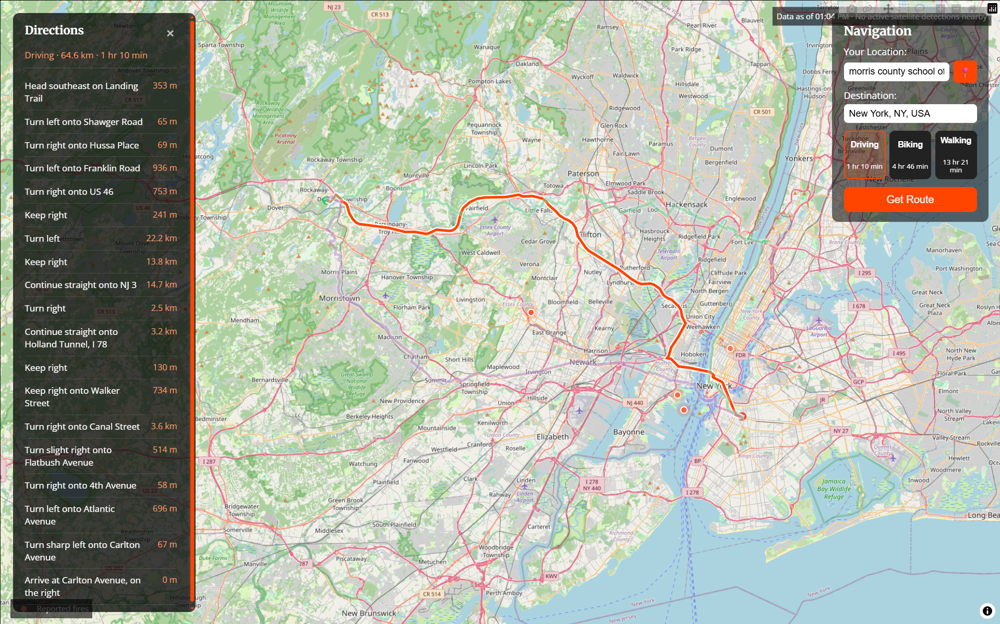

# Firewatch

A web app for locating active wildfires and routing around them. It combines user-reported fire data with live satellite detections (NASA FIRMS) and calculates safe driving, biking, and walking routes that avoid fire zones — complete with turn-by-turn directions.

**Live site:** https://firewatch-deployment.onrender.com



---

## How to run it

### 1. Clone and install

```bash
git clone <your-repo-url>
cd firewatch-deployment
pip install -r requirements.txt
```

### 2. Get API keys

- **OpenRouteService** (required, powers geocoding + routing) — [free signup](https://openrouteservice.org/dev/#/signup)
- **NASA FIRMS** (optional, powers the satellite fire layer) — [free key](https://firms.modaps.eosdis.nasa.gov/api/map_key/). Without it, the app still runs fine with reported fires only.

### 3. Set environment variables

```bash
export ORS_API_KEY=your_openrouteservice_key
export FIRMS_API_KEY=your_firms_key   # optional
```

### 4. Run it

```bash
uvicorn map:app --reload
```

Open `http://localhost:8000`.

---

## License

MIT — see [LICENSE](LICENSE).
